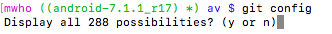

# Installation #
[git-scm](https://git-scm.com/downloads) contains different verions for mac/linus/win.
[github desktop](https://desktop.github.com) is a GUI git client for github, also could be used for local git repo. Simple to use, most concepts are identical to git.   


# Environment #   
there are some greate scripts to make git easier in command line.    
- get following two files in your home directory.  
[git-completion.bash](https://raw.githubusercontent.com/git/git/master/contrib/completion/git-completion.bash): for git command completion, there's a local version.  
[git-prompt.sh](https://raw.githubusercontent.com/git/git/master/contrib/completion/git-prompt.sh): showing user name, branch name and changes, really useful.  
- add following part in your ~/.bash_profile
```sh
# git part starts
# Enable tab completion
source ~/git-completion.bash
# Colors
green="\[\033[0;32m\]"
blue="\[\033[0;34m\]"
purple="\[\033[0;35m\]"
reset="\[\033[0m\]"
# Change command prompt
source ~/git-prompt.sh
export GIT_PS1_SHOWDIRTYSTATE=1
# '\u' adds the name of the current user to the prompt
# '\$(__git_ps1)' adds git-related stuff
# '\W' adds the name of the current directory
export PS1="$purple\u$green\$(__git_ps1)$blue \W $ $reset"
# git part ends
```
- after restart terminal, should be like this.     
     

# Git Configuration #
```sh
git config --global user.name "<username>"   
git config --global user.email "<email addr>"   
git config --global push.default upstream   
git config --global merge.conflictstyle diff3   
```

# Other Resouces #
[udacity-ud775](https://www.udacity.com/course/how-to-use-git-and-github--ud775): it is a good tutorial of git basics.
